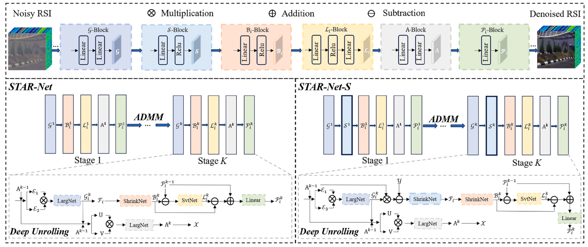

# STAR-Net
The code in this toolbox implements "STAR-Net: An Interpretable Model-Aided Network for Remote Sensing Image Denoising" by <i>J. Liu, J. Jin, X. Xiu, J. Zhang, W. Liu</i>.

### Testing
Directly run demo.py for reproduction.

### Citation
Please give credits to this paper if this code is useful and helpful for your research.

     @article{liu2025star,
      title     = {STAR-Net: An Interpretable Model-Aided Network for Remote Sensing Image Denoising},
      author    = {Liu, Jingjing and Jin, Jiashun and Xiu, Xianchao and Zhang, Jianhua and Liu, Wanquan},
      journal   = {Pattern Recognition},
      year      = {2025},
      volume    = {173},
      number    = {},
      pages     = {112496},
      publisher = {Elsevier}
     }

